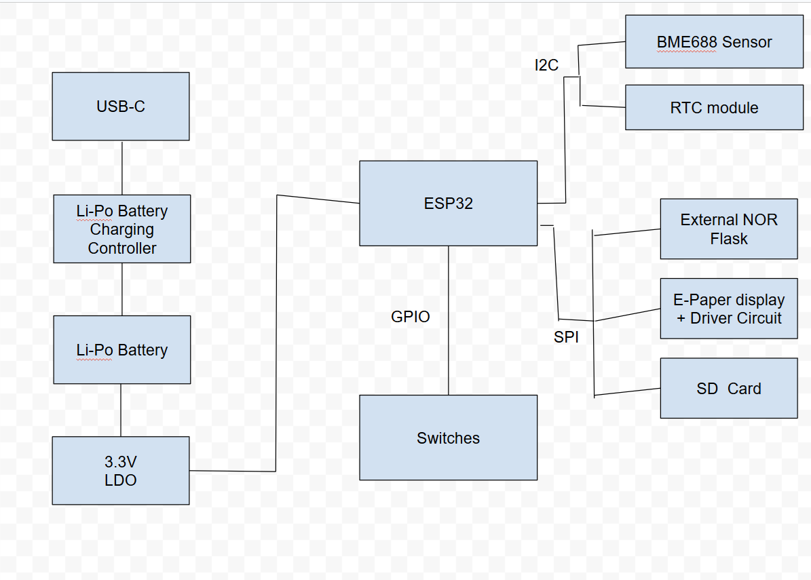

# 📦 ESP32-C6 ePaper Project

Un proiect hardware ce integrează un modul **ESP32-C6**, un **display e-Paper 7.5"**, alimentare prin **baterie Li-Ion** și conexiuni de testare prin **testpad-uri**. Proiectul este optimizat pentru consum redus de energie și design compact în carcasă personalizată 3D.

---

## 📊 Diagrama bloc

---

## 📦 BOM – Bill of Materials
| Componentă                 | Achiziție                                     | Datasheet                                   |
|---------------------------|-----------------------------------------------|---------------------------------------------|
| PFMF.050.1                | [Cumpără](https://ro.mouser.com/ProductDetail/Schurter/PFMF.050.2?qs=1auRipcfynCums5v1iucSA%3D%3D)                     | [Datasheet](https://ro.mouser.com/datasheet/2/358/typ_PFMF-1275918.pdf)                 |
| USB4110-GF-A              | [Cumpără]((https://ro.mouser.com/ProductDetail/GCT/USB4110-GF-A?qs=KUoIvG%2F9IlYiZvIXQjyJeA%3D%3D))                     | [Datasheet]((https://ro.mouser.com/datasheet/2/837/GCT_USB4110_Product_Drawing___20k_cycles-3455479.pdf))                 |
| USBLC6-2SC6Y              | [Cumpără]((https://ro.mouser.com/ProductDetail/STMicroelectronics/USBLC6-2SC6Y?qs=gNDSiZmRJS%2FOgDexvXkdow%3D%3D))                     | [Datasheet]((https://ro.mouser.com/datasheet/2/389/usblc6_2sc6y-1852505.pdf))                 |
| SD0805S020S1R0            | [Cumpără]((https://ro.mouser.com/ProductDetail/KYOCERA-AVX/SD0805S020S1R0?qs=jCA%252BPfw4LHbpkAoSnwrdjw%3D%3D))                     | [Datasheet]((https://ro.mouser.com/datasheet/2/40/schottky-3165252.pdf))                 |
| DMG2305UX-7               | [Cumpără]((https://ro.mouser.com/ProductDetail/Diodes-Incorporated/DMG2305UX-7?qs=L1DZKBg7t5F%2FNBHrjfxC%252Bg%3D%3D))                     | [Datasheet]((https://www.diodes.com/assets/Datasheets/DMG2305UX.pdf))                 |
| XC6220A331MR-G            | [Cumpără]((https://ro.mouser.com/ProductDetail/Torex-Semiconductor/XC6220A331MR-G?qs=AsjdqWjXhJ8ZSWznL1J0gg%3D%3D))                     | [Datasheet]((https://ro.mouser.com/datasheet/2/760/xc6220-3371556.pdf))                 |
| Condensator 100 uF TANT   | [Cumpără]((https://ro.mouser.com/ProductDetail/KYOCERA-AVX/TAJW107M010RNJ?qs=Wtp%252Bf%2FAeVqIH8v1VxV%252B1Rg%3D%3D))                     | [Datasheet]((https://ro.mouser.com/datasheet/2/40/TAJ-3165264.pdf))                 |
| 112A-TAAR-R03_ATTEND      | [Cumpără]((https://www.digikey.ro/en/products/detail/attend-technology/112A-TAAR-R03/17633923))                     | [Datasheet]((https://www.attend.com.tw/data/download/file/112A-TAAR-R03_Spec.pdf))                 |
| ESP32-C6-WROOM-1-N8       | [Cumpără]((https://ro.mouser.com/ProductDetail/Espressif-Systems/ESP32-C6-WROOM-1-N8?qs=8Wlm6%252BaMh8ST02Gmwp74cw%3D%3D))                     | [Datasheet]((https://ro.mouser.com/datasheet/2/891/Espressif_ESP32_C6_WROOM_1__Datasheet_V0_1_PRELIMI-3239987.pdf))                 |
| MCP73831                  | [Cumpără]((https://ro.mouser.com/ProductDetail/Microchip-Technology/MCP73831T-2ACI-OT?qs=yUQqVecv4qvbBQBGbHx0Mw%3D%3D))                     | [Datasheet]((https://ro.mouser.com/datasheet/2/268/MCP73831_Family_Data_Sheet_DS20001984H-3441711.pdf))                 |
| CHG_LED                   | [Cumpără]((https://store.comet.srl.ro/Catalogue/Product/40478/))                     | [Datasheet]((https://www.snapeda.com/parts/KP-1608SURCK/Kingbright/datasheet/))                 |
| SI1308EDL-T1-GE3          | [Cumpără]((https://ro.mouser.com/ProductDetail/Vishay-Semiconductors/SI1308EDL-T1-GE3?qs=bX1%252BNvsK%2FBramh9tgpOaEw%3D%3D))                     | [Datasheet]((https://www.vishay.com/doc?63399))                 |
| MBR0530                   | [Cumpără]((https://ro.mouser.com/ProductDetail/Micro-Commercial-Components-MCC/MBR0530-T?qs=9VyI4qLX4NTSXkb9ynzJnA%3D%3D))                     | [Datasheet]((https://ro.mouser.com/datasheet/2/258/mcc_mbr0520~mbr0560sod123-1179695.pdf))                 |
| Bobina                    | [Cumpără]((https://ro.mouser.com/ProductDetail/Wurth-Elektronik/744043680?qs=PGXP4M47uW6VkZq%252BkzjrHA%3D%3D))                     | [Datasheet]((https://www.we-online.com/components/products/datasheet/744043680.pdf))                 |
| FH34SRJ-24S-0.5SH_99_     | [Cumpără]((https://ro.mouser.com/ProductDetail/Hirose-Connector/FH34SRJ-24S-0.5SH99?qs=vcbW%252B4%252BSTIpKBl5ap9J8Fw%3D%3D))                     | [Datasheet]((https://ro.mouser.com/datasheet/2/185/FH34SRJ_24S_0_5SH_99__CL0580_1255_6_99_2DDrawing_0-1615044.pdf))                 |
| BME688                    | [Cumpără]((https://ro.mouser.com/ProductDetail/Bosch-Sensortec/BME688?qs=IS%252B4QmGtzzqQoVDscqwx3A%3D%3D))                     | [Datasheet]((https://ro.mouser.com/datasheet/2/783/bst_bme688_fl000-2307034.pdf))                 |
| BD5229G-TR                | [Cumpără]((https://ro.mouser.com/ProductDetail/ROHM-Semiconductor/BD5229G-TR?qs=4kLU8WoGk0vvnhrrYwdszw%3D%3D))                     | [Datasheet]((https://fscdn.rohm.com/en/products/databook/datasheet/ic/power/voltage_detector/bd52xxg-e.pdf))                 |
| Switch             | [Cumpără]((https://ro.mouser.com/ProductDetail/CK/KMR221GULCLFS?qs=u2NJ%252B70r0goBXaNk7IrU0Q%3D%3D))                     | [Datasheet]((https://www.ckswitches.com/media/1479/kmr2.pdf))                 |
| MAX17048G+T10             | [Cumpără]((https://ro.mouser.com/ProductDetail/Analog-Devices-Maxim-Integrated/MAX17048G%2bT10?qs=D7PJwyCwLAoGnnn8jEPRBQ%3D%3D))                     | [Datasheet]((https://ro.mouser.com/datasheet/2/609/MAX17048_MAX17049-3469099.pdf))                 |
| W25Q512JVEIQ              | [Cumpără]((https://ro.mouser.com/ProductDetail/Winbond/W25Q512JVEIQ?qs=l7cgNqFNU1jw6svr3at6tA%3D%3D))                     | [Datasheet]((https://ro.mouser.com/datasheet/2/949/Winbond_W25Q512JV_Datasheet-3240039.pdf))                 |
| PGB1010603MR              | [Cumpără]((https://ro.mouser.com/ProductDetail/Littelfuse/PGB1010603MRHF?qs=KvZd0dN2Zg%2FuIq6icj%252BGKA%3D%3D))                     | [Datasheet]((https://www.littelfuse.com/media?resourcetype=datasheets&itemid=8a337998-d54d-466b-be4e-dc5bcd1f9321&filename=littelfuse_pulseguard_pgb1_datasheet.pdf))                 |
| QWIIC_RIGHT_ANGLE         | [Cumpără]([(https://ro.mouser.com/ProductDetail/Analog-Devices-Maxim-Integrated/DS3231SN?qs=ffX8NcjNb2RmKAb9wAk9Ug%3D%3D)](https://ro.mouser.com/ProductDetail/GCT/USB4110-GF-A?qs=KUoIvG%2F9IlYiZvIXQjyJeA%3D%3D))                     | [Datasheet]((https://ro.mouser.com/datasheet/2/837/GCT_USB4110_Product_Drawing___20k_cycles-3455479.pdf))                 |
| DS3231SN#                 | [Cumpără]((https://ro.mouser.com/ProductDetail/Analog-Devices-Maxim-Integrated/DS3231SN?qs=ffX8NcjNb2RmKAb9wAk9Ug%3D%3D))                     | [Datasheet]((https://ro.mouser.com/datasheet/2/609/DS3231-3421123.pdf))                 |
| CPH3225A C10_SUPERCAP     | [Cumpără]((https://ro.mouser.com/ProductDetail/Seiko-Semiconductors/CPH3225A?qs=3etwrb1wR%252BhUOph6lAO7eg%3D%3D))                     | [Datasheet]((https://ro.mouser.com/datasheet/2/360/Seiko_Instruments_MicroBattery_E_20230330_2024Jan_-3561061.pdf))                 |
| Condensator 100nF         | [Cumpără]((https://ro.mouser.com/ProductDetail/KYOCERA-AVX/06033G104ZAT2A?qs=NXubJDmysXJMPmHfVo6Z%252BA%3D%3D))                     | [Datasheet]((https://ro.mouser.com/datasheet/2/40/KGM_Y5V-3223189.pdf))                 |
| Condensator 4.7uF         | [Cumpără]((https://ro.mouser.com/ProductDetail/KYOCERA-AVX/0402ZD475MAT2A?qs=NBFAU1oqP4W4U2PCPHI0sg%3D%3D))                     | [Datasheet]((https://ro.mouser.com/datasheet/2/40/cx5r_KGM-3223198.pdf))                 |
| Condensator 10uF          | [Cumpără]((https://ro.mouser.com/ProductDetail/Samsung-Electro-Mechanics/CL10A106KQ8NNNL?qs=xZ%2FP%252Ba9zWqaes9JKSsob2Q%3D%3D))                     | [Datasheet]((https://ro.mouser.com/datasheet/2/585/MLCC-1837944.pdf))                 |
| Condensator 1uF/50V       | [Cumpără]((https://ro.mouser.com/ProductDetail/KYOCERA-AVX/06035D105MAT2A?qs=k4kUdCzLgS5%252BURKe1SOIeQ%3D%3D))                     | [Datasheet]((https://ro.mouser.com/datasheet/2/40/cx5r_KGM-3223198.pdf))                 |
| Rezistență 10K            | [Cumpără]((https://ro.mouser.com/ProductDetail/Vishay-Beyschlag/MCS0402MD1002BE000?qs=17u8i%2FzlE8%2F9BrAaXkMk1w%3D%3D))                     | [Datasheet]((https://www.vishay.com/doc?28952))                 |
| Rezistență 200            | [Cumpără]((https://ro.mouser.com/ProductDetail/Vishay-Beyschlag/MCS0402MD2000BE100?qs=3SvaY9RawMJNVte4F12%252BZQ%3D%3D))                     | [Datasheet]((https://www.vishay.com/doc?28952))                 |
| Rezistență 100K           | [Cumpără]((https://ro.mouser.com/ProductDetail/Vishay-Beyschlag/MCT0603PD1003DP500?qs=5aG0NVq1C4wWAn8Ei3OpZA%3D%3D))                     | [Datasheet]((https://www.vishay.com/doc?28916))                 |
| Rezistență 2.2            | [Cumpără]((https://ro.mouser.com/ProductDetail/SEI-Stackpole/RMCF0402FT2R20?qs=IPgv5n7u5QbBgyl0jwhwsA%3D%3D))                     | [Datasheet]((https://ro.mouser.com/datasheet/2/385/SEI_RMCF_RMCP-3077565.pdf))                 |
| Rezistență 5K1            | [Cumpără]((https://www.venkel.com/part/TFCR0603-16W-K-5690FT))                     | [Datasheet]((https://ro.mouser.com/datasheet/2/385/SEI_RMCF_RMCP-3077565.pdf))                 |
| Rezistență 2K             | [Cumpără]((https://ro.mouser.com/ProductDetail/Vishay-Beyschlag/MCS04020C2001FE000?qs=wTZ%2FFzl837YG0wIkZJJOwQ%3D%3D))                     | [Datasheet]((https://www.vishay.com/doc?28705))                 |
| Rezistență 0.47           | [Cumpără]((https://ro.mouser.com/ProductDetail/SEI-Stackpole/CSR0402JKR470?qs=IPgv5n7u5QawIB6nBEt8wA%3D%3D))                     | [Datasheet]((https://ro.mouser.com/datasheet/2/385/SEI_CSR_CSRN-3077593.pdf))                 |
| Rezistență 15             | [Cumpără]((https://ro.mouser.com/ProductDetail/YAGEO/RT0402FRE0715RL?qs=BXCcY9r%252B08DFFpLSkPOIqQ%3D%3D))                     | [Datasheet]((https://ro.mouser.com/datasheet/2/447/PYu_RT_1_to_0_01_RoHS_L_15-3461507.pdf))                 |
                                                  |

---

## ⚙️ Funcționalitate Hardware

- 🧠 **ESP32-C6**: procesor principal, WiFi și BLE
- 🖼️ **Display e-Paper 7.5”**: conectat prin interfață SPI
- 🔋 **Baterie Li-Ion 3.7V**: conectare directă la testpad-uri
- 🧪 **Testpad-uri**: pentru alimentare, măsurători și debugging
- 🧲 Toate GND-urile sunt conectate într-un plan de masă dublu (top/bottom) cu **via stitching**

---

# Tabel Pini ESP32-C6 - Configurație și Funcții

| Nume            | GPIO / Pin       | Funcție                              | Descriere                                                                 |
|-----------------|------------------|--------------------------------------|---------------------------------------------------------------------------|
| 3V3             | 3V3              | Sursă 3.3V                           | Asigură alimentarea necesară funcționării ESP32-C6 și componentelor logice |
| EN (Reset)      | EN               | Activare/Dezactivare microcontroler | Reset hardware prin semnal LOW                                            |
| USB_D-          | IO12             | Linie USB negativă                   | Parte din perechea diferențială pentru USB 2.0                            |
| USB_D+          | IO13             | Linie USB pozitivă                   | Parte din perechea diferențială pentru USB 2.0                            |
| Buton Boot      | IO9              | Mod bootloader                       | Se conectează la GND pentru a iniția programarea                          |
| Buton Change    | IO15             | Mod operare                          | Comută între moduri definite în firmware                                  |
| TX (UART)       | GPIO16 (TXD0)    | UART TX                              | Transmitere date seriale                                                  |
| RX (UART)       | GPIO17 (RXD0)    | UART RX                              | Recepție date seriale                                                     |
| SCK (SPI)       | IO6              | SPI Clock                            | Ceas pentru comunicația SPI                                               |
| MOSI (SPI)      | IO7              | SPI Master Out                       | Transmitere date SPI                                                      |
| MISO (SPI)      | IO2              | SPI Master In                        | Recepție date SPI                                                         |
| FLASH_CS        | IO11             | Chip Select NOR Flash                | Activează memoria flash                                                   |
| EPD_CS          | IO10             | Chip Select E-Paper                  | Activează ecranul E-Paper                                                 |
| EPD_DC          | IO5              | Comandă/Date E-Paper                 | Diferențiază comenzi vs date pentru E-Paper                              |
| EPD_RST         | IO23             | Reset E-Paper                        | Reset hardware pentru E-Paper                                             |
| EPD_BUSY        | IO3              | Busy E-Paper                         | Semnalizează că E-Paper este ocupat                                      |
| SDA (I2C)       | IO21             | I2C Data                             | Comunicație cu RTC, BME688, etc.                                          |
| SCL (I2C)       | IO22             | I2C Clock                            | Ceas I2C                                                                  |
| SS_SD           | IO4              | Chip Select SD Card                  | Activează cardul SD                                                       |
| I2C_PW          | IO19             | Power control senzori I2C            | Activează/dezactivează alimentarea senzorilor I2C                         |
| EPD_3V3_C       | IO20             | Alimentare 3.3V E-Paper              | Sursă dedicată pentru E-Paper                                             |
| 32KHZ           | IO1              | Semnal 32kHz                         | Clock pentru RTC sau alte funcții                                         |
| INT_RTC         | IO0              | Întrerupere RTC                      | Trezește sistemul sau semnalează un eveniment RTC                         |
| RTC_RST         | IO18             | Reset RTC                            | Permite resetarea manuală a ceasului RTC                                  |

---

## 🖼️ Design Mecanic & 3D

- ✅ PCB proiectat și exportat 3D în Autodesk Fusion
- ✅ Model 3D complet pentru **baterie** și **display**, pe baza dimensiunilor din datasheet
- ✅ Integrare completă în **carcasa 3D** (asamblare în Fusion)
- ✅ Exploded view pentru randare și prezentare

---

## 🖼️ Randări

- ✅ `Images/pcb3d.png` – Randare 3D a plăcii
- ✅ `Images/produs3d.png` – Placa în carcasă
- ✅ `Images/exploded.png` – Vedere explodată

---

## Etape de implementare:
 - Am inceput cu asamblarea pieselor in schematic din biblioteca data, apoi cu trecerea la placa pcb, decuparea placii, masuratori luate pentru amplasarea corecta a pieselor si pentru integrarea usoara a placii in carcasa data.
 - A urmat amplasarea pieselor, am facut traseele de putere manual cu grosimea de 0.3mm, iar apoi pentru celelate trasee am folosit autoroute, cu grosimea de 0.16mm, un singur vias pe un traseu de putere am avut pentru ca nu am mai avut cum sa il leg pe layer-ul top.
 - Am facut planul de masa pe bottom si pe top, am folosit via stitching.
 - Iar apoi am trecut la pcb in 3d, am incarcat toate piesele in 3d si am trecut la masuratorile pentru baterie si ecran.
 - Bateria am facut-o simpla cu doua iesiri legate la doua testpaduri, vbat si gnd.

# Erori
1. Am avut doua erori pe care le-am aprobat in pcb("Copper Width"), dar ele aveau grosimea buna.
2. Am gresit ceva si m-am intors la o varianta anterioara a pcb ului si dupa nu a mai fost sincronizat cu schematicul si nu mi a mai mers randarea in 3d a placii si am luat totul de la inceput.

